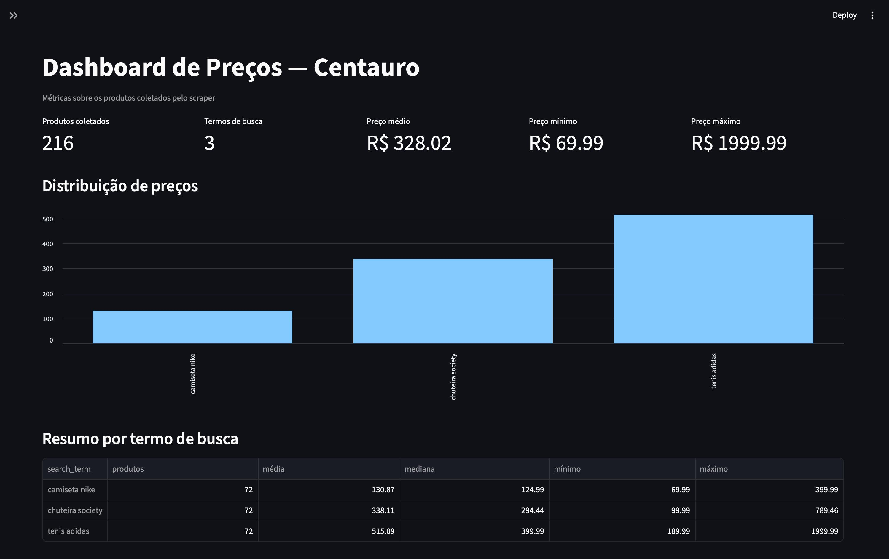

# Centauro Scraper

---



---

Coletor de produtos da Centauro a partir de termos de busca, com paginação, resiliência, exportação estruturada e dashboard de preços.

## Requisitos atendidos

- Entrada via JSON, TXT ou CSV
- Coleta de `search_term`, `product_name`, `price` e `product_url`
- Paginação das 2 primeiras páginas por termo, quando existirem
- Tratamento de falhas com logs sem interromper a execução
- Saída em JSON e Parquet
- Dashboard com métricas de preço

## Como executar

```bash
poetry install
poetry run python src/main.py --stdout
```

Entrada customizada:

```bash
poetry run python src/main.py --input src/input.json --output-dir output
```

Dashboard:

```bash
poetry run streamlit run src/dashboard.py
```

## Decisões técnicas

- A Centauro expõe dados via endpoint interno do Next.js (`/_next/data/{buildId}/busca/{slug}.json`).
- O `buildId` é extraído da home e reutilizado durante a execução.
- A página 1 usa apenas `searchSlug`; a página 2 usa `page=2`.
- `curl_cffi` simula um navegador real e reduz bloqueios por anti-bot.
- Falhas são tratadas por termo e por página, com retry exponencial nas requisições HTTP.

## Uso de IA

A IA foi usada como apoio para:

- teste de fumaça com a tentativa de obter dados rapidamente atraves do HTML (tentativa foi mal sucedida por conta da proteção akamai)
- investigar a estrutura da API Next.js da Centauro
- validar a estratégia de paginação
- organizar módulos e revisar resiliência

As decisões finais de arquitetura, parsing, logging e formato de saída foram implementadas manualmente neste repositório.